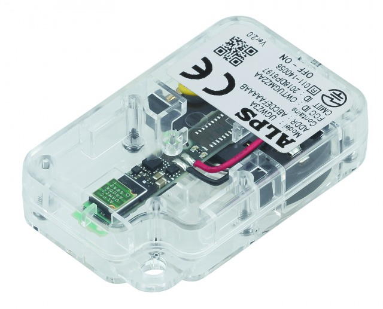

# IoT data analysis system using ALPS sensor
Simple IoT system to collect ALPS sensor data for time series analysis tutorial
- Overview
  - Collecting ALPS sensor data  
  - Sending to PostgreSQL databas
  - Analyzing sensor data by python
## ALPS sensor

- https://www.alps.com/j/iotsmart/
- Acquires sensor data
  - motion
    - acceleration / magnetic
  - environment
    - pressure / temperature / humidity / UV / luminosity
- Communication using BlueTooth
### Collecting ALPS sensor data
- Used sample code in the following blog to collect sensor data
  - Blog: https://tomosoft.jp/design/?p=8104
  - correction for some data values
- Outputting sensor values to console
- Sampling rate
  - Motion sensor : 1sec
  - Environmental sensor : 1min
## Sending to database
- PostgreSQL database on Docker container 
- Used python subprocess to read console output
## Analysis
- Tutorial for time series analysis
  - Fetching data from PostgreSQL database
  - Tutorial for typical techniques for time series analysis
  - Visualization of sensor data
- Link for jupyter notebook
  - https://nbviewer.ipython.org/gist/yuikosakuma/cadd2c8f083742d6197da7d2fd4666b8    
### Experiment
- Collected data in the laboratory in Fabruary, 2018
- Used this data and tutorial for education for B4 
